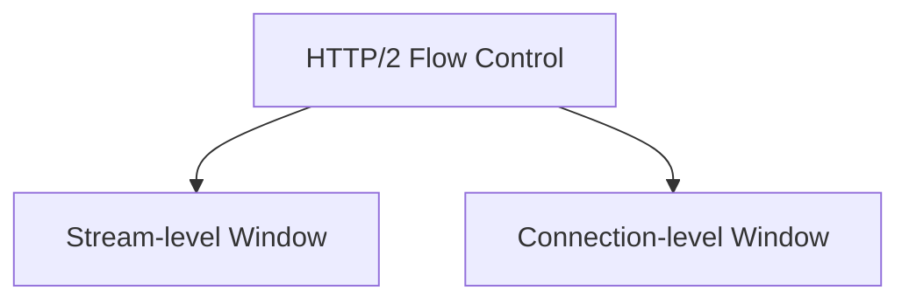
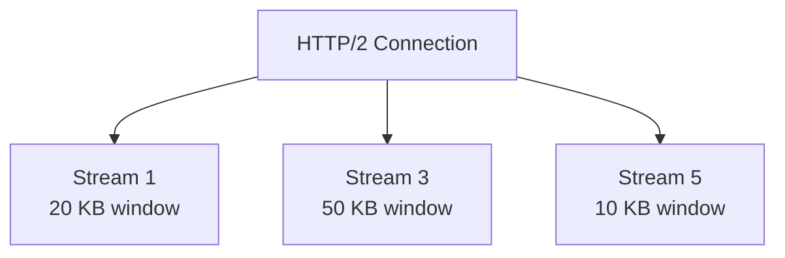
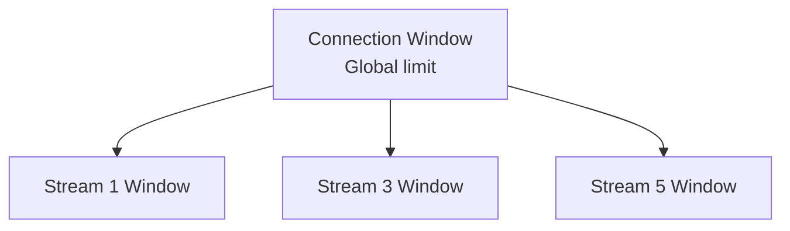
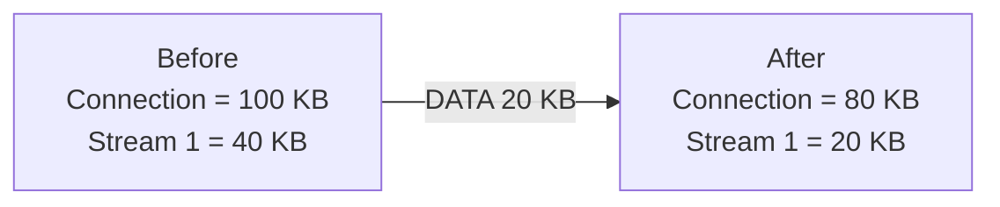
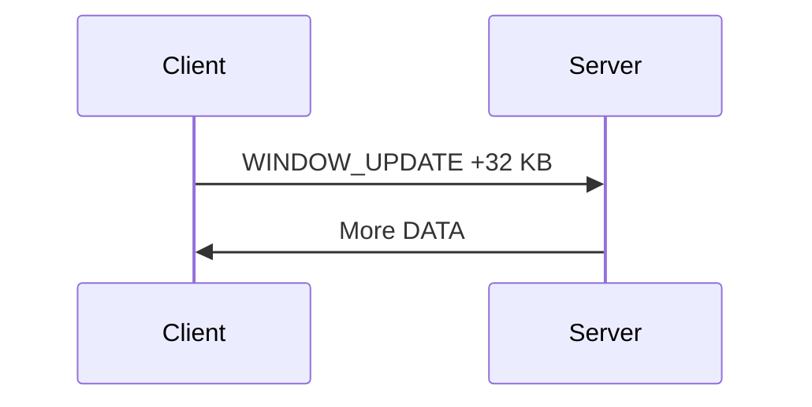
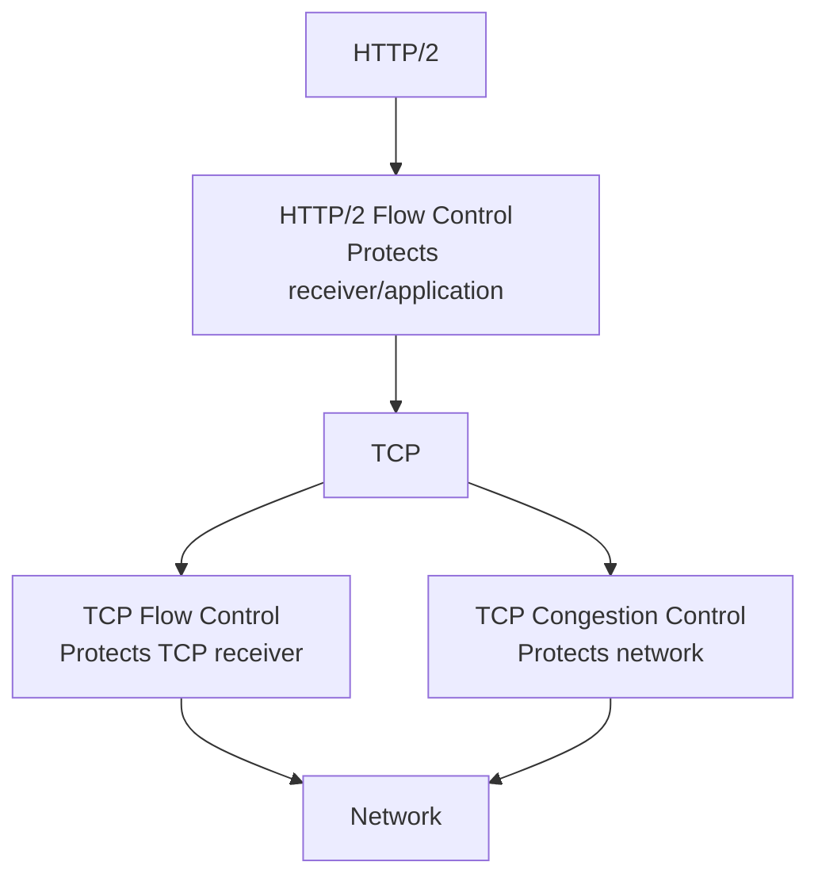
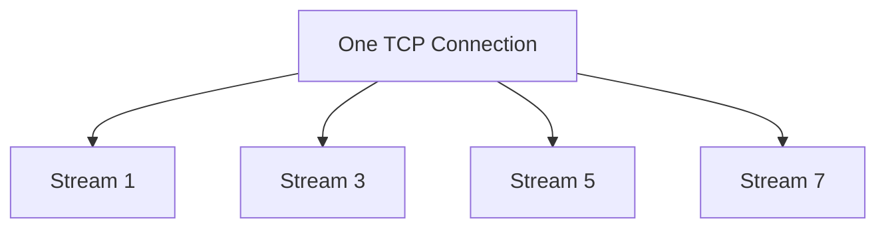

# Lesson 32 - HTTP/2 Flow Control & Stream Management

## Objectives

- Understand why HTTP/2 needs flow control.
- Distinguish stream-level and connection-level flow control.
- Understand `WINDOW_UPDATE`.
- Understand how HTTP/2 manages multiple independent streams.
- Distinguish flow control from TCP flow control and congestion control.

## Concept Summary

HTTP/2 multiplexes many logical streams over one TCP connection. A fast sender could otherwise overwhelm a receiver with DATA. HTTP/2 therefore uses receiver-driven flow control.

There are two levels of flow control:



## Two Levels of Flow Control

### Stream-level flow control

Each HTTP/2 stream has its own flow-control window.



If Stream 5 reaches zero, it cannot send more DATA, but other streams may continue if they have available credit.

### Connection-level flow control

The connection also has a global flow-control window. It limits the aggregate amount of DATA that can be outstanding across all streams.



The two levels work together:

```text
Stream-level window
        +
Connection-level window
        ↓
Maximum DATA currently allowed
```

## DATA Consumes Both Windows

Suppose:

```text
Connection window = 100 KB
Stream 1 window   = 40 KB
```

The server sends 20 KB on Stream 1:



The same DATA therefore consumes credit at both levels.

## WINDOW_UPDATE

When the receiver consumes data and wants to allow more DATA, it sends a `WINDOW_UPDATE` frame.



A `WINDOW_UPDATE` identifies the flow-control window it updates:

- Stream ID `0` → connection-level window.
- Non-zero Stream ID → that stream's window.

## Sending Rule

Conceptually, a sender can transmit DATA only when both conditions hold:

```text
stream window > 0
AND
connection window > 0
```

The actual amount that can be sent is constrained by the available credit at both levels.

## Flow Control vs Other Controls

HTTP/2 flow control, TCP flow control and TCP congestion control operate at different layers and solve different problems.



More precisely:

```text
HTTP/2 flow control -> protects the HTTP/2 receiver/application
TCP flow control    -> protects the TCP receiver
TCP congestion ctrl -> protects the network
```

## Stream Management

HTTP/2 maintains independent logical streams inside one connection. Streams can progress or close independently without necessarily closing the underlying TCP connection.



This enables multiple logical request/response exchanges to share one transport connection.

## Production Perspective

A production HTTP/2 implementation must track connection and per-stream state, available flow-control credit, buffered DATA, stream lifecycle and scheduling decisions.

Flow control determines whether DATA may be sent; it does not decide which eligible stream should be served first.

## Common Mistakes

- Assuming TCP flow control makes HTTP/2 flow control unnecessary.
- Thinking a stream-level window controls the entire connection.
- Thinking `WINDOW_UPDATE` sends data rather than increasing sending credit.
- Confusing flow control with congestion control.
- Assuming a blocked stream necessarily blocks every other HTTP/2 stream.

## Key Takeaways

1. HTTP/2 uses receiver-driven flow control for DATA.
2. Flow control exists at both stream and connection levels.
3. DATA consumes credit from both windows.
4. `WINDOW_UPDATE` increases available credit.
5. Stream ID `0` represents the connection-level window.
6. Flow control limits how much may be sent; scheduling decides which eligible stream gets service.
7. HTTP/2 streams remain logical streams even though they share one TCP connection.

## Reflection Questions

- Why does HTTP/2 need flow control if TCP already has flow control?
- Why are both stream-level and connection-level windows necessary?
- What would happen if only a connection-level window existed?
- How is flow control different from congestion control?
- Why can one blocked stream still allow other streams to progress?

## Related Lessons

- Lesson 27 - HTTP/2 Fundamentals
- Lesson 28 - HTTP/2 Frames and Streams
- Lesson 29 - HTTP/2 Multiplexing
- Lesson 33 - HTTP/2 Stream Prioritization & Scheduling
