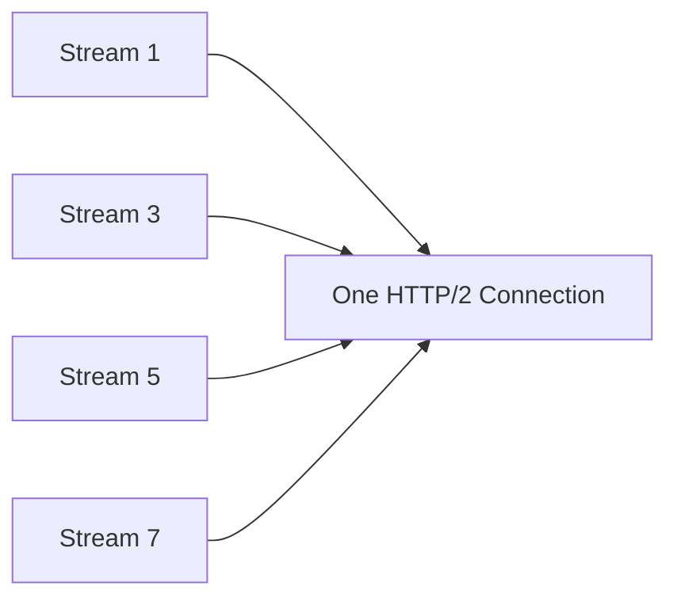
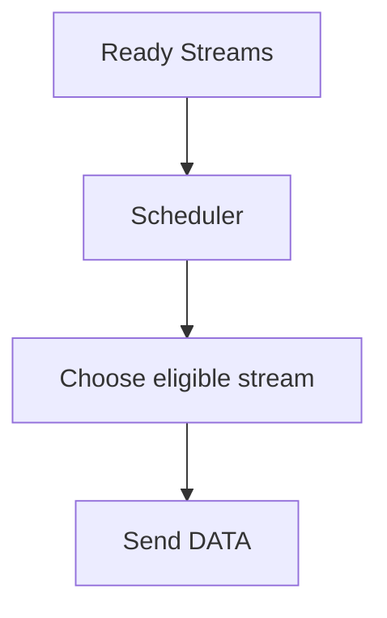
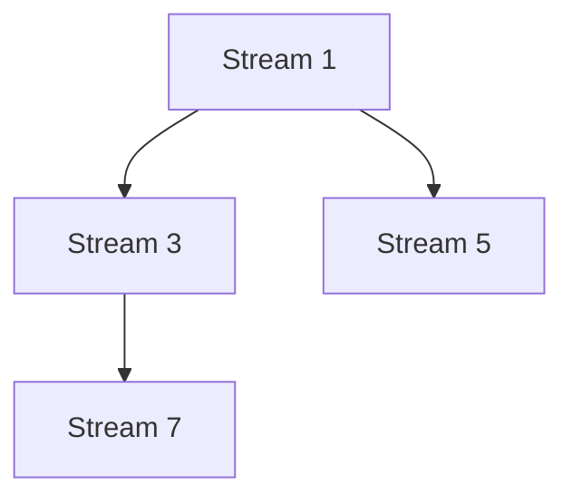
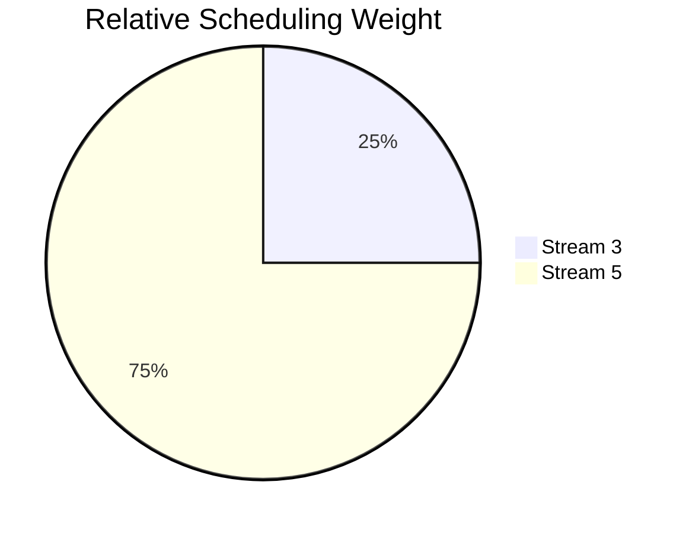
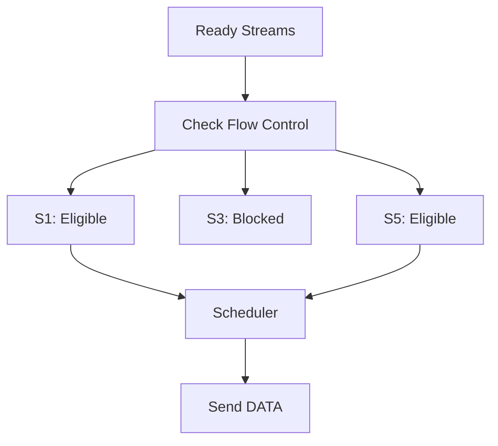
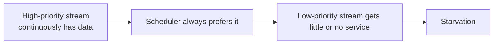
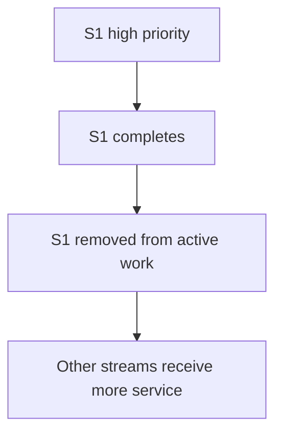
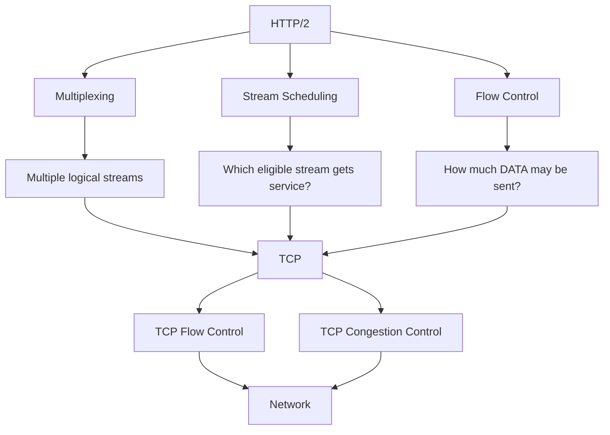

# Lesson 33 - HTTP/2 Stream Prioritization & Scheduling

## Objectives

- Understand why HTTP/2 needs stream scheduling.
- Distinguish scheduling from flow control and multiplexing.
- Understand HTTP/2's original dependency and weight model.
- Understand weighted scheduling, fairness and starvation.
- Understand why prioritization is a resource-allocation problem.

## Concept Summary

HTTP/2 multiplexes many streams over one connection. Once flow control determines which streams are allowed to send, the implementation still needs to decide which eligible stream should receive transmission opportunities.

```text
Flow Control -> Can this stream send?
Scheduling   -> Which eligible stream should send?
```

## Multiplexing vs Scheduling

Multiplexing makes concurrent streams possible:



Scheduling determines how those streams are actually served.



## HTTP/2 Priority Model

HTTP/2 originally represented stream priorities using:

- stream dependencies
- stream weights

The dependencies formed a priority tree.



This allows the scheduler to reason about relationships between streams rather than treating all streams as completely independent.

## Stream Weights

Weights represented relative scheduling preference among competing streams under the same scheduling context.

For example:

```text
Stream 3 = weight 4
Stream 5 = weight 12
```

The relative preference is:

```text
Stream 3 : Stream 5
     4    :    12
     1    :     3
```

Conceptually, if both continuously compete for the same scheduling opportunity, Stream 5 may receive roughly three times as much service as Stream 3.



## Weight Is Not Guaranteed Bandwidth

A weight is a scheduling preference, not a reservation.

Actual transmission is affected by:

```text
flow control
TCP receive window
TCP congestion control
other streams
application behavior
server implementation
```

Therefore a weight of 12 does not mean a stream receives exactly a fixed percentage of the network.

## Scheduling Policies

A server may use policies such as:

- Round Robin
- Weighted Round Robin
- Priority scheduling
- Weighted fair scheduling

### Round Robin

```text
S1 → S3 → S5 → S1 → S3 → S5 → ...
```

Simple and fair, assuming comparable work units.

### Weighted scheduling

For weights:

```text
S1 = 1
S3 = 2
S5 = 3
```

A conceptual service pattern is:

```text
S1 | S3 S3 | S5 S5 S5
```

The exact implementation can differ, but the important idea is relative service allocation.

## Flow Control Interaction

A scheduler cannot select a stream that is currently blocked by flow control for DATA transmission.



The conceptual server loop is:

```text
Ready streams
      ↓
Remove flow-control-blocked streams
      ↓
Apply scheduling policy
      ↓
Send DATA
```

## Fairness and Starvation

Always serving the highest-priority stream can starve lower-priority streams if the high-priority stream remains continuously backlogged.



A practical scheduler therefore often balances priority with fairness.

## Completion Changes Scheduling

Scheduling decisions are dynamic. Once a stream completes, the scheduler no longer needs to allocate service to it.



## Production Perspective

Stream scheduling is a resource-allocation problem. The server has finite network capacity, buffers and processing resources while many streams compete for service.

The objective may be to improve page rendering, minimize latency for important resources, maximize throughput, or maintain fairness. There is no universally optimal policy.

## Modern Context

HTTP/2's original dependency-tree priority model proved difficult to use consistently in practice. Modern HTTP prioritization uses a more flexible model based on the Extensible Prioritization Scheme and the `Priority` HTTP field.

The broader lesson is that protocol-level scheduling hints must translate into practical server resource-allocation decisions.

## HTTP/2 Scheduling in the Larger Stack



This separation is important:

```text
Multiplexing -> makes concurrent streams possible
Flow control -> limits how much may be sent
Scheduling   -> decides which eligible stream gets service
TCP          -> provides the underlying reliable byte stream
```

## Common Mistakes

- Treating multiplexing as automatic fairness.
- Treating priority weight as guaranteed bandwidth.
- Assuming scheduling overrides flow control.
- Confusing scheduling with congestion control.
- Assuming higher priority always means a stream must be completed before all others progress.

## Key Takeaways

1. Multiplexing enables multiple streams; scheduling decides how they share service.
2. Flow control determines whether a stream is currently allowed to send DATA.
3. HTTP/2 originally used dependency trees and weights for stream prioritization.
4. Weights represent relative preference rather than guaranteed bandwidth.
5. Pure priority scheduling can cause starvation.
6. Production scheduling balances priority, fairness and system constraints.
7. HTTP/2 prioritization evolved toward more flexible modern prioritization mechanisms.

## Reflection Questions

- What is the difference between multiplexing, flow control and scheduling?
- Why is a priority weight not a bandwidth guarantee?
- Why must a scheduler consider flow-control state?
- How can a high-priority stream starve a low-priority stream?
- Why might fairness be preferable to always serving the highest-priority stream?
- Why is stream scheduling fundamentally a resource-allocation problem?

## Related Lessons

- Lesson 29 - HTTP/2 Multiplexing
- Lesson 32 - HTTP/2 Flow Control & Stream Management
- Lesson 34 - QUIC Fundamentals
